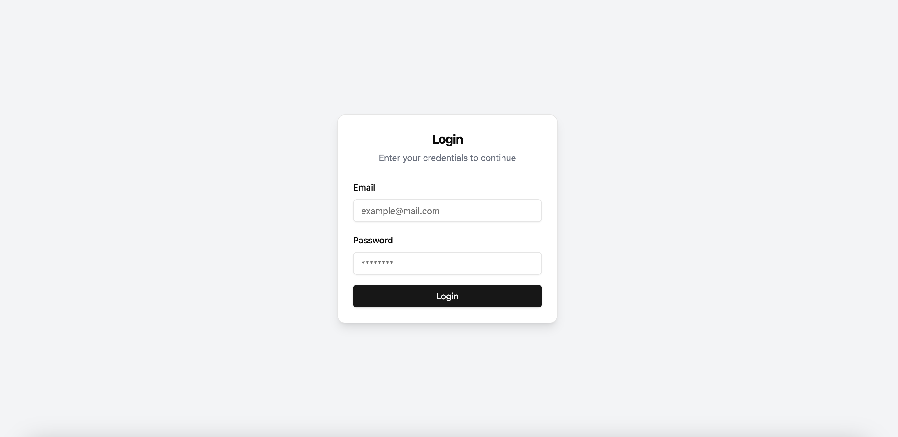
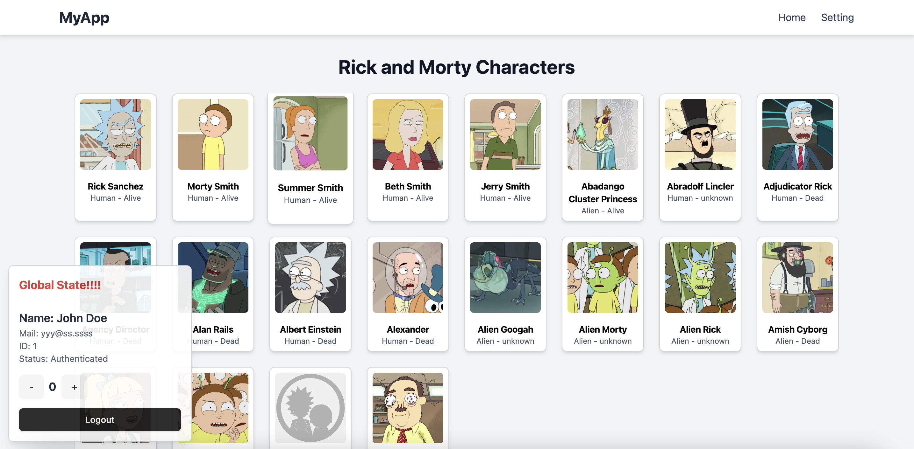

# React 19 SPA Boilerplate
## Demo: https://c441b8d5.react-spa-51g.pages.dev/login
## Overview
This is a **React 19 SPA (Single Page Application) boilerplate** designed for scenarios where the backend is handled separately via REST APIs. While modern best practices often favor SSR (Server-Side Rendering) or SSG (Static Site Generation) for performance and efficiency, this setup intentionally leverages SPA mode to optimize frontend-backend separation.

### Features:
- **State Management:** Zustand
- **Styling:** Tailwind CSS
- **Headless UI Components:** ShadCN/UI
- **Validation:** Zod
- **Forms Handling:** React Hook Form *(Note: Expected to become redundant with React 19's new features.)*
- **Routing:** React Router 7
- **Bundling:** Vite
- **API Handling:** Axios

This boilerplate follows **modern development standards** to maximize efficiency while keeping a clean and scalable structure.

**Note:** This project uses the previous generation of React Router's routing method. If you want to develop with the latest version, modifications will be required.

---

## 📁 Project Structure

```
react-spa/
├── dist/                   # Build output directory
├── node_modules/           # Dependencies
├── public/                 # Static assets (e.g., vite.svg)
├── readmeAssets/           # Images used in the README
│   ├── home.png
│   ├── login.png
├── src/                    # Main source code
│   ├── assets/             # Static assets for the app
│   ├── components/         # Reusable UI components
│   │   ├── ui/             # ShadCN/UI-based components
│   │   │   ├── Navbar.tsx
│   ├── helper/             # Utility functions
│   ├── hooks/              # Custom hooks
│   ├── layouts/            # Layout components
│   ├── lib/                # External library configurations
│   ├── pages/              # Application pages
│   │   ├── Home.tsx
│   │   ├── Login.tsx
│   │   ├── Setting.tsx
│   ├── store/              # Zustand store management
│   │   ├── main.tsx
│   ├── utils/              # General utility functions
│   ├── App.css             # Global styles
```

---

## 🚀 Getting Started

### 1️⃣ Install Dependencies
```sh
npm install
```

### 2️⃣ Start Development Server
```sh
npm run dev
```

### 3️⃣ Build for Production
```sh
npm run build
```

### 4️⃣ Preview Production Build
```sh
npm run preview
```

---

## 🖥️ Demo Screenshots

### Login Page


### Home Page


---

## 🔗 Useful References

- **ShadCN UI Components:** [ShadCN Docs](https://ui.shadcn.com/docs/components/accordion)
- **Zustand State Management:** [Zustand Docs](https://github.com/pmndrs/zustand)
- **React Router 7:** [React Router Docs](https://reactrouter.com/)

---

## 🎯 Deployment
This project is deployed on **Cloudflare Pages** using GitHub Actions.

---

## 🛠️ Dependencies
```json
"react": "19.0.0",
"react-dom": "19.0.0",
"react-router": "^7.1.5",
"zustand": "^5.0.3",
"tailwindcss": "^3.4.17",
"shadcn/ui": "latest",
"zod": "^3.24.1",
"react-hook-form": "^7.54.2"
```

For the full list of dependencies, check `package.json`.

---

## 📌 Notes
- **React 19 introduces built-in form handling, reducing the need for external libraries like React Hook Form in the future.**
- **This setup is optimized for scenarios where the frontend communicates with a separately managed backend via REST APIs.**
- **For larger-scale applications, consider SSR/SSG approaches like Remix and Next.js.**

---

## 📄 License
MIT License

